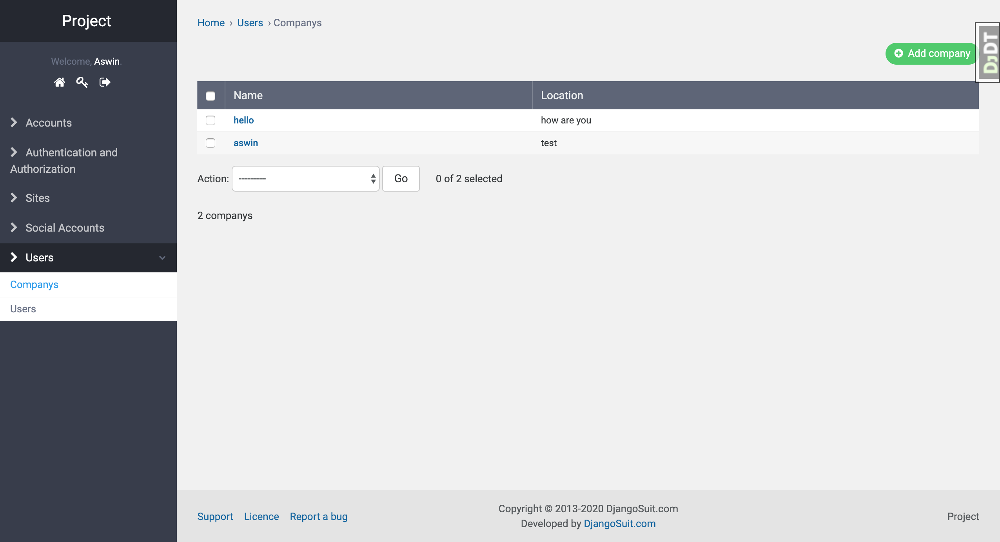

# Django Boilerplate Application

This is a sample application where you can build a django application on top of this

  - Profiling of django application , local, testing and production
  - Django Rest Framework
  - Serializes
  - Admin template
  - Token authenticated


### Installation
Create a virtual environment & activate

```sh
$ python3 -m venv name
$ source name/bin/activate
```

Install pqsl, run the following command after logged into the psql console

```sh
CREATE DATABASE project;
CREATE ROLE project WITH LOGIN PASSWORD 'password';
GRANT ALL PRIVILEGES ON DATABASE project TO project;
ALTER ROLE project CREATEDB; 
ALTER ROLE "project" WITH LOGIN;
```

### Profiling Your Django app

There are 3 types of profile in this template, local, production and testing. Configuration can be changed as follows while running the application.

```sh
python manage.py runserver --settings=config.settings.local # Default without params
python manage.py runserver --settings=config.settings.production
python manage.py runserver --settings=config.settings.testing
```

### Dump your dp
Create custom command file `seed_db.py` it should be in your `app/users/management/commands/seed_db.py` and run the command. Run this command before staring your server in order to create login ids.

```sh
python manage.py seed_db
```

### Token authentication
Add `rest_framework.authtoken` in the INSTALLED_APP

We need to add `signals.py` in the app root folder.

```
from django.conf import settings
from django.dispatch import receiver
from rest_framework.authtoken.models import Token
from django.db.models.signals import post_save


@receiver(post_save, sender=settings.AUTH_USER_MODEL)
def create_auth_token(sender, instance=None, created=False, **kwargs):
    if created:
        Token.objects.create(user=instance)
```
In the models import the signals which will act as a middleware
```
from .signals import create_auth_token  # noqa
```

### Development
Create super user, go to the project root and create super users
```sh
$ python manage.py makemigrations
$ python manage.py migrate # db migrate
```
In the browser open http://localhost:8000/admin/

### Home page

### Todos

 - Write Ansible scripts to deploy in the cloud
 - Tie this app with mgunicorn

